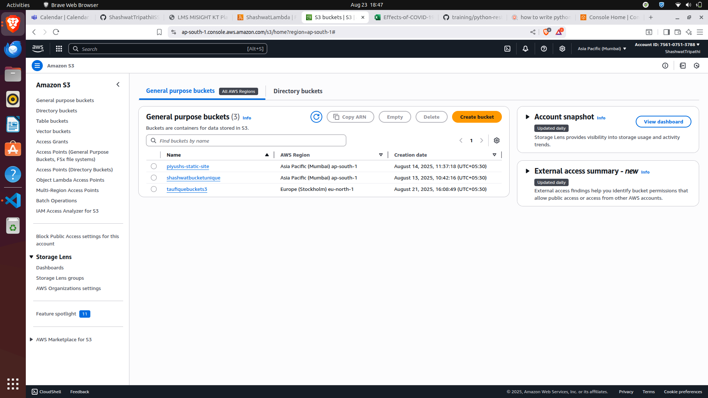
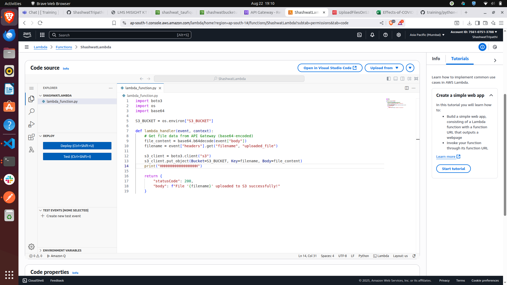
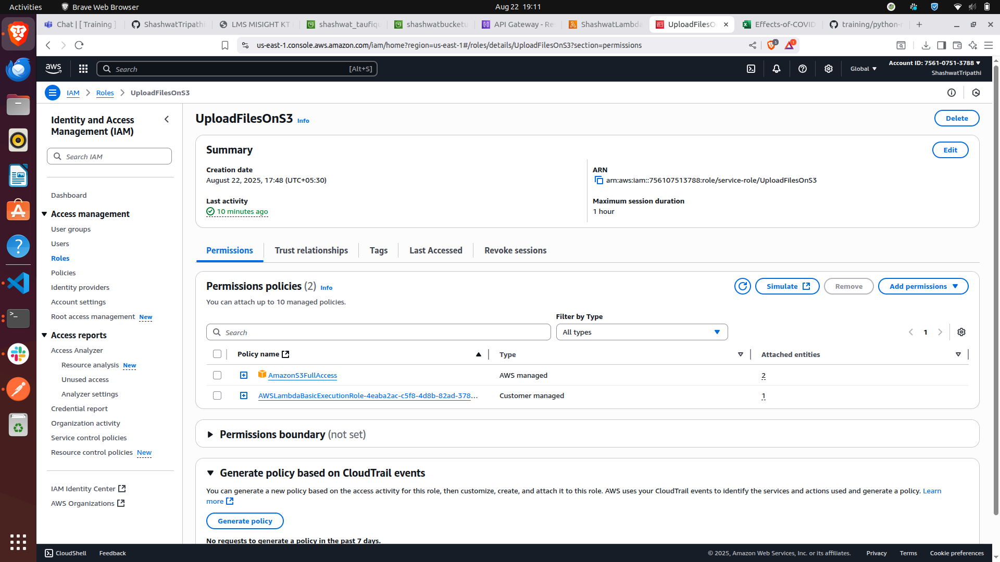
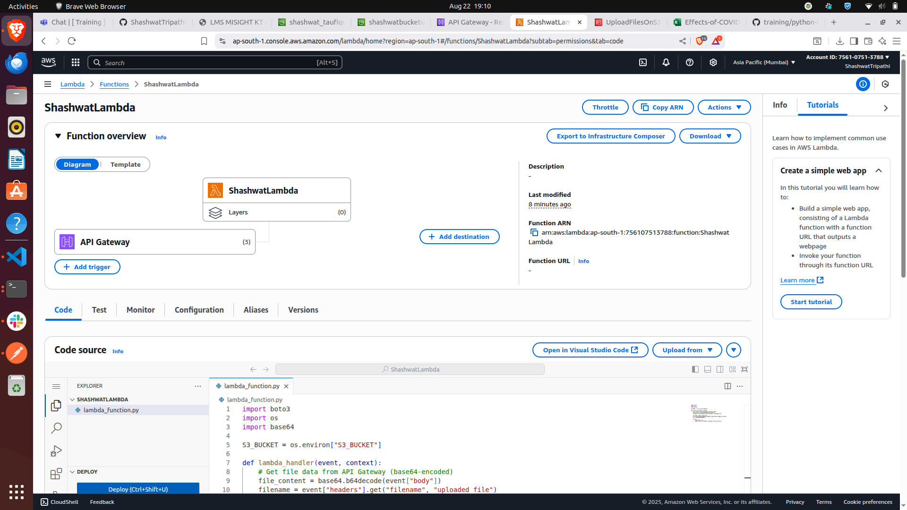
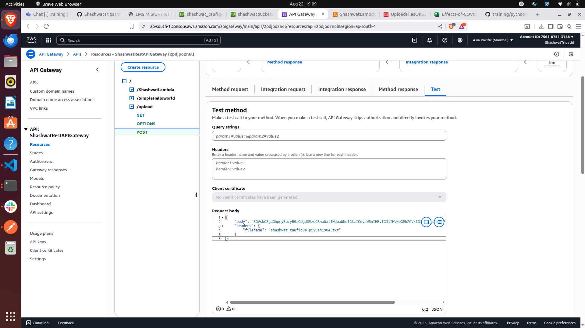
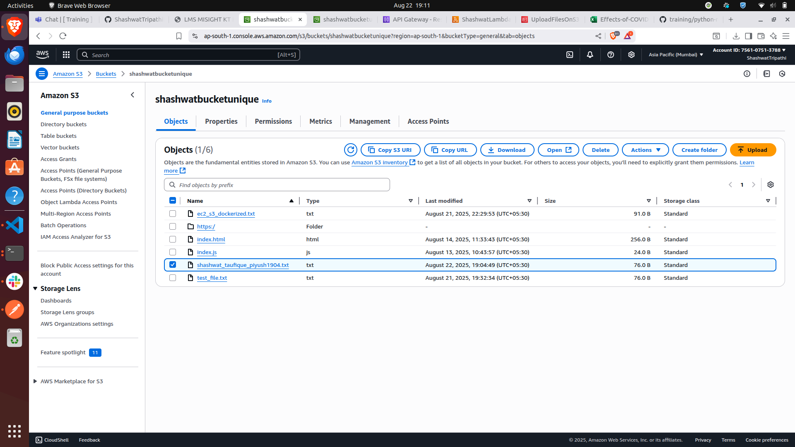
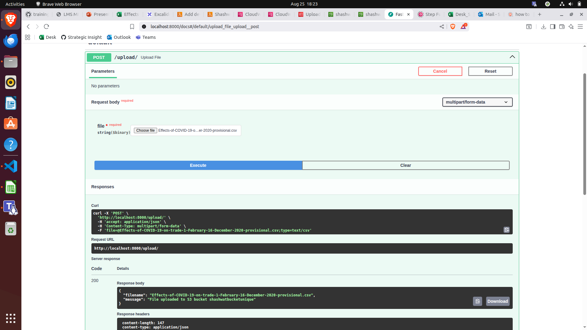
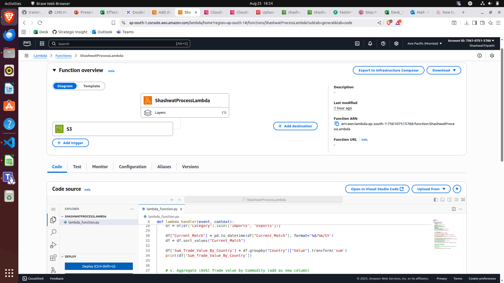
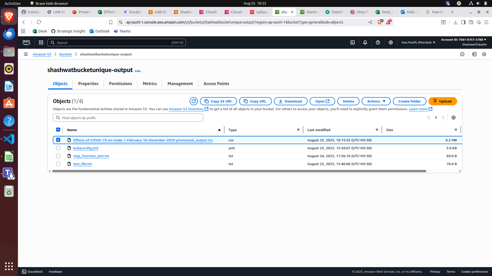
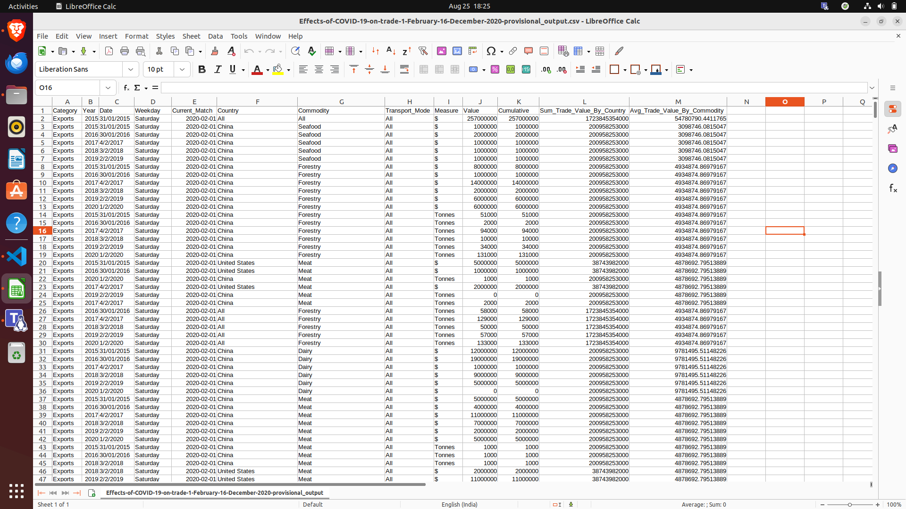

# training

## AWS POC

### Task 1: Create a free-tier account on AWS
Set-up keys and MFA for your account<br>


-------------
-------------
### Task 2: Launch an EC2 instance 
Generate key pairs and set it up such that only you can SSH into it<br>
1. I have generated key pairs and downloaded the .pem file.<br>
2. Now, I will open terminal in the directory where I have saved the .pem file.<br>
3. Running this command to ensure my key is not publicly viewable: `chmod 400 "ShashwatKeyPair.pem"`<br>
4. Finally the ssh command to connect to the Linux EC2 instance: `ssh -i "ShashwatKeyPair.pem" ubuntu@ec2-65-2-4-52.ap-south-1.compute.amazonaws.com`


Result:


Note: The instance also has `python3` and `docker` installed.

-------------
-------------
### Task 3: Create a bucket on S3
<h4>The S3 bucket should not be publicly accessible.</h4><br>



-------------
-------------
### Task 4: Write a REST API (using python3) to upload file to S3
<h4>Write a REST API (using python3) to upload file to S3</h4>
1. I have created a simple FastAPI application which takes any file as user input.<br>
2. Then I have configured an IAM user with policy to be able to put files in the s3 bucket.<br>
3. The uploaded file on FastAPI page gets uploaded in the S3 bucket.


Result:

File uploaded on swagger:<br>


S3 bucket shows the file:<br>


-------------
<h4>Dockerize the API created in and deploy it on the EC2 machine</h4>


1. We have pushed the above code into a repository.


2. Then we connected to the EC2 instance using SSH.


3. We cloned our repo in that instance machine and created a .env file in our project.


4. Adding our secret passwords will make it available inside the ec2 instance for the container to use it.


5. Trying to build the docker container using `docker buildx build -t python-rest .`

``
ERROR: permission denied while trying to connect to the Docker daemon socket at unix:///var/run/docker.sock: Head "http://%2Fvar%2Frun%2Fdocker.sock/_ping": dial unix /var/run/docker.sock: connect: permission denied
``


6. The error was solved after giving the user some permissions to run the `docker build` command:<br>


7. Now we run the build command again.<br>


8. Now we run the docker container: `docker run -d -p 8081:8000 --env-file .env --name python-rest python-rest`<br>


9. Get the public IP of instance using: `curl http://checkip.amazonaws.com`. Using curl to test the application deployment just by looking at the landing page:<br>

<br>


Final Output:<br>


-----------
<h4>Now deploy the REST API created on API Gateway and have a lambda function running behind the API Gateway</h4>


1. We create a lambda function which will upload the file in our s3 bucket.
```python
import boto3
import os
import base64

S3_BUCKET = os.environ["S3_BUCKET"]

def lambda_handler(event, context):
    # Get file data from API Gateway (base64-encoded)
    file_content = base64.b64decode(event["body"])
    filename = event["headers"].get("filename", "uploaded_file")

    s3_client = boto3.client("s3")
    s3_client.put_object(Bucket=S3_BUCKET, Key=filename, Body=file_content)

    return {
        "statusCode": 200,
        "body": f"File '{filename}' uploaded to S3 successfully!"
    }
```

<br>


2. Now, we grant permission to the lambda function to have S3FullAccess.

<br>


3. Now, we connect the lambda function to an API Gateway. This API Gateway will act as the main entry point for our users to interact with.<br>

<br>


4. After everything is running fine and checking it by a simple get request, we now send our file by encoding it using base64 and passing it into body.<br>

<br>


5. Checking the file on our S3 bucket.

<br>


-----------

### Task 5: Create a new Lambda function and invoke it on the s3 event when the file is uploaded on S3 
<h4>The lambda function should read the file : https://issgovernance-my.sharepoint.com/:x:/g/personal/neelakshi_kulkarni_iss-stoxx_com/ETTpldHSu21OhBrDKr_odQQBj_f7wzt2IthVS5SyO3zEvg?e=SdMntw</h4>


1. We have downloaded the csv file and now will upload it from the FastAPI docs page.<br>

<br>

FastAPI Code:
```python
from fastapi import FastAPI, File, UploadFile
from fastapi.responses import JSONResponse
import boto3
import os
from dotenv import load_dotenv

load_dotenv()

app = FastAPI()

AWS_ACCESS_KEY_ID = os.getenv("AWS_ACCESS_KEY_ID")
AWS_SECRET_ACCESS_KEY = os.getenv("AWS_SECRET_ACCESS_KEY")
AWS_REGION = os.getenv("AWS_REGION")
BUCKET1 = os.getenv("BUCKET1")

s3_client = boto3.client(
    "s3",
    aws_access_key_id=AWS_ACCESS_KEY_ID,
    aws_secret_access_key=AWS_SECRET_ACCESS_KEY,
    region_name=AWS_REGION
)

@app.post("/upload/")
async def upload_file(file: UploadFile = File(...)):
    try:
        file_content = await file.read()
        s3_client.put_object(Bucket=BUCKET1, Key=file.filename, Body=file_content)
        return JSONResponse(content={
            "filename": file.filename,
            "message": f"File uploaded to S3 bucket {BUCKET1}"
        })
    except Exception as e:
        return JSONResponse(content={"error": str(e)}, status_code=500)
```


2. We have written the code for lambda function to take file from the S3 bucket and process it and store in another bucket. S3PutObject has been added as a trigger event for this lambda.<br>

<br>


<h4>Perform following transformations (using python pandas) on the data 
i.  Rename "Direction" column to "Category" 
ii. Remove records where Category not in "Imports" or "Exports" 
iii.  Cast the column "Current_Match" into DATE datatype and sort the dataset by ascending order of Current Match 
iv. Aggregate (SUM) Trade value by Country 
v. Aggregate  (AVG) Trade value by Commodity</h4>


1. Processing logic is as follows(not entire function):
```python
    response = s3.get_object(Bucket=bucket1, Key=filename)
    content = response['Body'].read()

    df = pd.read_csv(io.StringIO(content.decode('utf-8')))
    
    
    # processing with pandas
    df = df.rename(columns={"Direction": "Category"})

    df = df[df["Category"].isin(["Imports", "Exports"])]

    df["Current_Match"] = pd.to_datetime(df["Current_Match"], format='%d/%m/%Y')
    df = df.sort_values("Current_Match")
    
    df['Sum_Trade_Value_By_Country'] = df.groupby("Country")["Value"].transform('sum')
    print(df['Sum_Trade_Value_By_Country'])


    # v. Aggregate (AVG) Trade value by Commodity (add as new column)
    df['Avg_Trade_Value_By_Commodity'] = df.groupby("Commodity")["Value"].transform('mean')
    print(df['Avg_Trade_Value_By_Commodity'])

    # Save processed DataFrame back to CSV
    processed_content = df.to_csv(index=False).encode('utf-8')
    filename = filename.replace(".csv", "")

    s3.put_object(Bucket=bucket2, Key=filename + "_output.csv", Body=processed_content)
```
<br>

<h4>Write the output file as filename_output back to s3 </h4>


1. Storing the file as filename_output in new S3 bucket.<br>

<br>


FINAL OUTPUT:

<br>


1. aws ecr get-login-password --region ap-south-1

eyJwYXlsb2FkIjoiaGwyUFVxbWxhNTROdzA0Rk9XYTUzbjFWbmFrSlVyWlE3c1NBaVprMVVYY2VZUWZiWExFSHA4VFN1SytBMWdVZ3FncVJtMlh2NXJzcmhWR1IxNmFWblFWczdlYW9tUHNyL2JpSVZQcU1pUUFqTC9WTlFTdVJZRkNpSE5uOU1BQTJZNjdOdHJaeGU5N2V6RlZlVUd3MWhYaTN3YXFjakw5UEVkajNVYlcyNEszWmNnV3JmdE5XdXJkRy9JdWs5UGZpNmpPV0Y3SGZPejdBNWN0TnJRVTlwaFNtOHp4VlZHaWVpZFVYdzRiK056c2MwN3FTYlE3cWV0YThjWElUZWdwSzlqQW9KQXV3aGlGckowUU1YeGc2NzZTa3J4b0NaK2xseGs4MVU3WHJ0SHJFM1Q4N0RVa0NFUDNOOEFCRFRPcXVkTDFFaFhtUUNNTC9jeFdIRE1ValpVZW9BWjJyLzhERzY5SGRyL3NvY1hrUnFsRXhmU2FRd1NyRU1XZzk5UUNOcTNpZVFTZFIyRVI4YlNFUml6MlVjd2tKcGdPZ2s2RGlGOXA4OG1rVzN5ekNsSzlYaGNiOFJVMHIzVVQ1Rm5vOUtGUTAzdmZheHhMc08wT3czYXpIcnluZjRnVEptVElTdTJNanZUS3ZZdXhUQnJTNVByZnN4Wi9NRFc4clNRdS8zaHpjWGxqM2poWnRVTnpMeENJNm9Yb2pPVkVCNnJ3QkMyMlRSWVhKWE1wZ3ZuV2xLc09DQm13M1laRWhidmEraThtZ0orbDJCdkd5aXBxZnY5MGJNbG9ISmRtTVZyNldUZER6blJYVzRTM2k1aGVnUFFEaHBCQmxScVhPK3R2UGxGb216OFk0bzRxckYvV1lCbHJ5T3YyeUhLSi9RYkw5WmFCYytpNnpLWVNERHNVT1BTcmUzVkNiZXRxVjJRdU5HOWFDZUI4SUNKcUNYeUNhUnA0ZEtVRnY0TXUyU1ZRRkwvcXRiMTR4V1l5aEVtMzRralJ1Q09XVVowNHlBdXhBL3JGaThpbXJNSUVzMFpuNjRDaDZVb1R0UWlGaG14OXk2Q0V2em8zL3dKejNyS05KR0NXVUtoc3FWbXNmWVd6TSsrcllxRytpN0xKbEV4T2VCUkNXYnBNcVZsZzJ5NU03bDBtK3VtUC9vcHNRc0V4OU14TWs5Ni9sblhqa1dCQUxDOWN6UHJsVTF4VHFNOCtEQ09PSVpiQUtjRk94Vy9BV09Qb1JwWmZ3OGh4MVpYc1o3M2FTSGFBV3h5b3k2VWdnNEhBN0NOTGFPaWJZQWtpbEFSS0xaWlNaRDJrc1RKWHAvZDJBei93aS9EejVhNmpRc0NaVU5rcnBMVStRMDZ2RlExc3J5bDZzc25RdGZ5dGNScXc4dGtQOTV2WHZTTXh5QjBXdWpZdVhmUWRZcGFPUXV3QjY3UE1HbTBwSzNDSjgxV0xndkVtU08yZkNLNHR0dzdSQ1FNcWhybHFjdmFRZTB2V3FnWTZDZ0hVMGxZU2dhMENiY1k3OEdrNHhFTFpNa3k2ODZtRVlmWTlJQWNjcjBrV1dCR0lzZll2MlJrT215WHE5RmcyaGtjbmEiLCJkYXRha2V5IjoiQVFJQkFIaUhXYVlUblJVV0NibnorN0x2TUcrQVB2VEh6SGxCVVE5RnFFbVYyNkJkd3dGdXkySExnNElueEYwRzIzK2h6MkZiQUFBQWZqQjhCZ2txaGtpRzl3MEJCd2FnYnpCdEFnRUFNR2dHQ1NxR1NJYjNEUUVIQVRBZUJnbGdoa2dCWlFNRUFTNHdFUVFNWkIyOG1Hbk9mcGJVMGVSVEFnRVFnRHZlOEQ1ck9FRnFNSmc2bFA4UWhGS1Z4SG1RZlNtdUxTaWEyRWJzN1UzMCtKZmhFMmpPdmpDL05UVE1CODI0UlRRd0dmMSs1b2liQXQzRzV3PT0iLCJ2ZXJzaW9uIjoiMiIsInR5cGUiOiJEQVRBX0tFWSIsImV4cGlyYXRpb24iOjE3NTYyNTA0MTF9

2. aws configure

3. aws ecr get-login-password --region ap-south-1 | sudo docker login --username AWS --password-stdin 756107513788.dkr.ecr.ap-south-1.amazonaws.com

4. aws ecr create-repository --repository-name lambda-processing-repo

5. sudo docker tag lambda-processing:latest 756107513788.dkr.ecr.ap-south-1.amazonaws.com/lambda-processing-repo:latest

6. sudo docker push 756107513788.dkr.ecr.ap-south-1.amazonaws.com/lambda-processing-repo:latest


aws ecs register-task-definition --cli-input-json file://task-definition.json

output of task definition:

{
    "taskDefinition": {
        "taskDefinitionArn": "arn:aws:ecs:ap-south-1:756107513788:task-definition/lambda-processing-task:1",
        "containerDefinitions": [
            {
                "name": "lambda-processing-container",
                "image": "756107513788.dkr.ecr.ap-south-1.amazonaws.com/lambda-processing-repo:latest",
                "cpu": 0,
                "portMappings": [
                    {
                        "containerPort": 80,
                        "hostPort": 80,
                        "protocol": "tcp"
                    }
                ],
                "essential": true,
                "environment": [
                    {
                        "name": "S3_BUCKET",
                        "value": "shashwatbucketunique"
                    }
                ],
                "mountPoints": [],
                "volumesFrom": [],
                "systemControls": []
            }
        ],
        "family": "lambda-processing-task",
        "executionRoleArn": "arn:aws:iam::756107513788:role/ecsTaskExecutionRole",
        "networkMode": "awsvpc",
        "revision": 1,
        "volumes": [],
        "status": "ACTIVE",
        "requiresAttributes": [
            {
                "name": "com.amazonaws.ecs.capability.ecr-auth"
            },
            {
                "name": "ecs.capability.execution-role-ecr-pull"
            },
            {
                "name": "com.amazonaws.ecs.capability.docker-remote-api.1.18"
            },
            {
                "name": "ecs.capability.task-eni"
            }
        ],
        "placementConstraints": [],
        "compatibilities": [
            "EC2",
            "FARGATE"
        ],
        "requiresCompatibilities": [
            "FARGATE"
        ],
        "cpu": "256",
        "memory": "512",
        "registeredAt": 1756364784.478,
        "registeredBy": "arn:aws:iam::756107513788:user/shashwat"
    }
}


{
  "StartAt": "Run ECS Task",
  "States": {
    "Run ECS Task": {
      "Type": "Task",
      "Resource": "arn:aws:states:::ecs:runTask.sync",
      "Parameters": {
        "Cluster": "arn:aws:ecs:ap-south-1:756107513788:cluster/piyush-fluffy-gecko-jsk256",
        "TaskDefinition": "arn:aws:ecs:ap-south-1:756107513788:task-definition/piyush-process-csv-task:2",
        "LaunchType": "FARGATE",
        "NetworkConfiguration": {
          "AwsvpcConfiguration": {
            "Subnets": [
              "subnet-0146283ce10ab58a8"
            ],
            "AssignPublicIp": "ENABLED",
            "SecurityGroups": [
              "sg-0f43bfee7516e0eca"
            ]
          }
        },
        "Overrides": {
          "ContainerOverrides": [
            {
              "Name": "piyush-process-csv-container",
              "Environment": [
                {
                  "Name": "S3_BUCKET",
                  "Value.$": "$.bucket"
                },
                {
                  "Name": "S3_KEY",
                  "Value.$": "$.key"
                }
              ]
            }
          ]
        }
      },
      "Next": "Check ECS Status"
    },
    "Check ECS Status": {
      "Type": "Choice",
      "Choices": [
        {
          "Variable": "$.Failures",
          "IsPresent": false,
          "Next": "Notify Success"
        }
      ],
      "Default": "Notify Failure"
    },
    "Notify Success": {
      "Type": "Task",
      "Resource": "arn:aws:states:::sns:publish",
      "Parameters": {
        "TopicArn": "arn:aws:sns:ap-south-1:756107513788:piyush-process-csv-pass",
        "Message": "ECS task completed successfully."
      },
      "End": true
    },
    "Notify Failure": {
      "Type": "Task",
      "Resource": "arn:aws:states:::sns:publish",
      "Parameters": {
        "TopicArn": "arn:aws:sns:ap-south-1:756107513788:piyush-process-csv-fail",
        "Message": "ECS task failed."
      },
      "End": true
    }
  }
}


// Final code for shashwat


{
  "StartAt": "Run ECS Task",
  "States": {
    "Run ECS Task": {
      "Type": "Task",
      "Resource": "arn:aws:states:::ecs:runTask.sync",
      "Parameters": {
        "Cluster": "arn:aws:ecs:ap-south-1:756107513788:cluster/comfortable-zebra-gpghss",
        "TaskDefinition": "arn:aws:ecs:ap-south-1:756107513788:task-definition/lambda-processing-task",
        "LaunchType": "FARGATE",
        "NetworkConfiguration": {
          "AwsvpcConfiguration": {
            "Subnets": [
              "subnet-0824399d22343dd1c"
            ],
            "AssignPublicIp": "ENABLED",
            "SecurityGroups": [
              "sg-0f43bfee7516e0eca"
            ]
          }
        },
        "Overrides": {
          "ContainerOverrides": [
            {
              "Name": "lambda-processing-container",
              "Environment": [
                {
                  "Name": "S3_BUCKET",
                  "Value": "shashwatbucketunique"
                },
                {
                  "Name": "INPUT_KEY",
                  "Value.$": "$.key"
                }
              ]
            }
          ]
        }
      },
      "Next": "Check ECS Status"
    },
    "Check ECS Status": {
      "Type": "Choice",
      "Choices": [
        {
          "Variable": "$.Failures",
          "IsPresent": false,
          "Next": "Notify Success Lambda"
        }
      ],
      "Default": "Notify Failure Lambda"
    },
    "Notify Success Lambda": {
      "Type": "Task",
      "Resource": "arn:aws:states:::lambda:invoke",
      "Parameters": {
        "FunctionName": "NotifySuccessLambda",
        "Payload": {
          "Status": "SUCCESS",
          "bucket.$": "$.bucket",
          "key.$": "$.key",
          "ECSResult.$": "$"
        }
      },
      "End": true
    },
    "Notify Failure Lambda": {
      "Type": "Task",
      "Resource": "arn:aws:states:::lambda:invoke",
      "Parameters": {
        "FunctionName": "NotifyFailureLambda",
        "Payload": {
          "Status": "FAILURE",
          "bucket.$": "$.bucket",
          "key.$": "$.key",
          "ECSResult.$": "$"
        }
      },
      "End": true
    }
  }
}