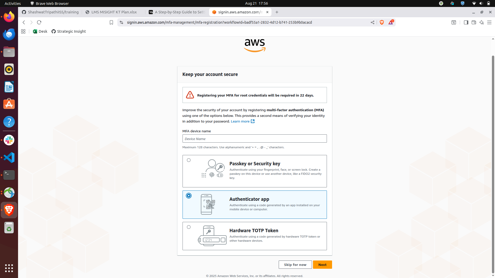
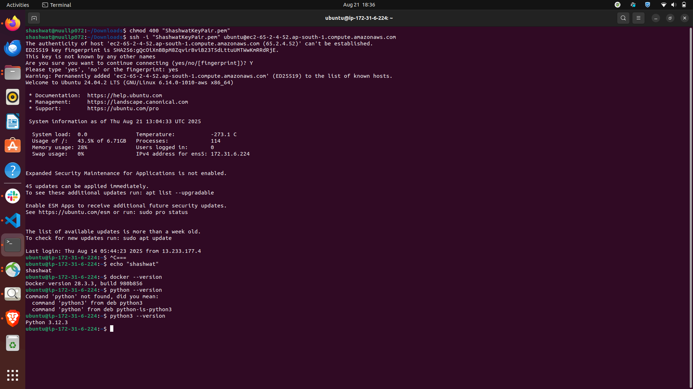
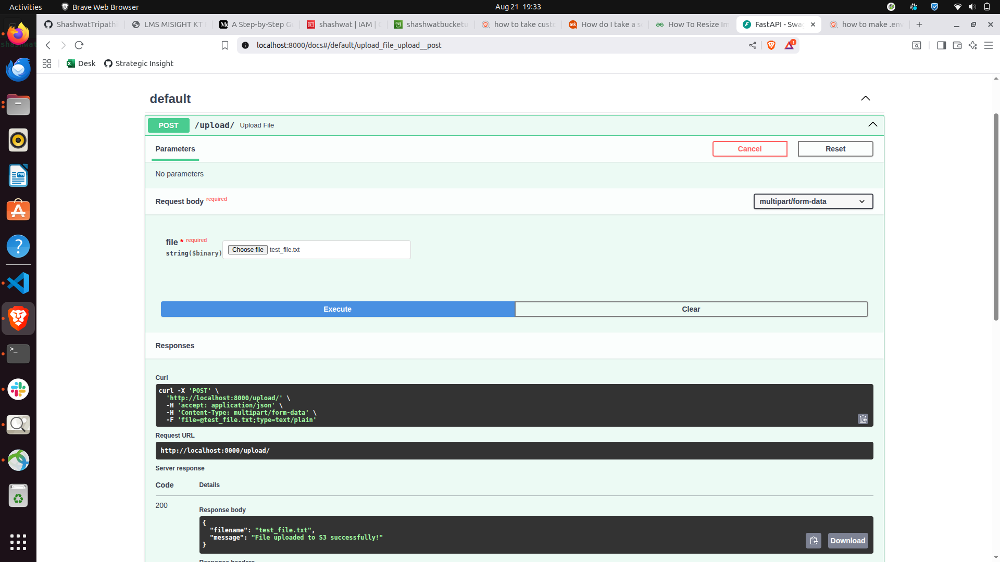
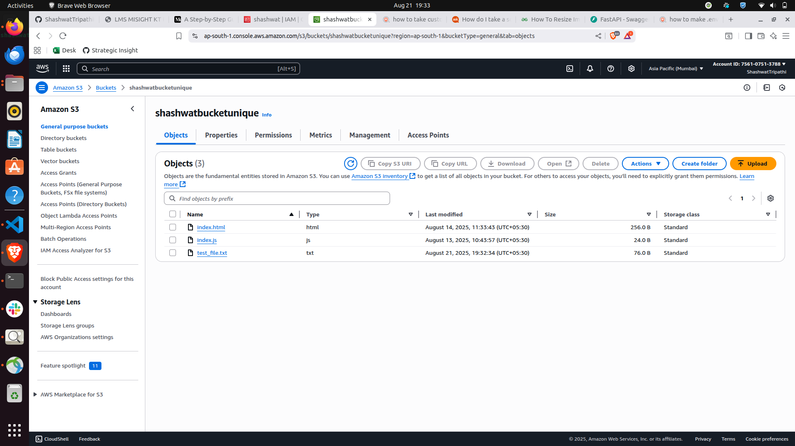

# training

## AWS POC

### Task 1: Create a free-tier account on AWS
Set-up keys and MFA for your account 

-------------
### Task 2: Launch an EC2 instance 
Generate key pairs and set it up such that only you can SSH into it 
1. I have generated key pairs and downloaded the .pem file. 
2. Now, I will open terminal in the directory where I have saved the .pem file. 
3. Running this command to ensure my key is not publicly viewable: `chmod 400 "ShashwatKeyPair.pem"` 
4. Finally the ssh command to connect to the Linux EC2 instance: `ssh -i "ShashwatKeyPair.pem" ubuntu@ec2-65-2-4-52.ap-south-1.compute.amazonaws.com`

Result:

Note: The instance also has `python3` and `docker` installed.

-------------
### Task 4: Write a REST API (using python3) to upload file to S3

1. I have created a simple FastAPI application which takes any file as user input.
2. Then I have configured an IAM user with policy to be able to put files in the s3 bucket.
3. The uploaded file on FastAPI page gets uploaded in the S3 bucket.

Result:

File uploaded on swagger: 

S3 bucket shows the file: 
