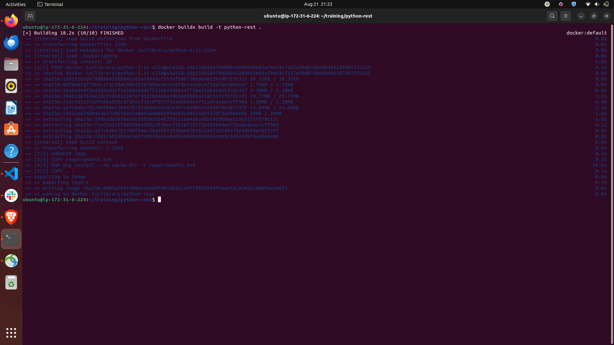

# training

## AWS POC

### Task 1: Create a free-tier account on AWS
Set-up keys and MFA for your account 

-------------
### Task 2: Launch an EC2 instance 
Generate key pairs and set it up such that only you can SSH into it 
1. I have generated key pairs and downloaded the .pem file. 
2. Now, I will open terminal in the directory where I have saved the .pem file. 
3. Running this command to ensure my key is not publicly viewable: `chmod 400 "ShashwatKeyPair.pem"` 
4. Finally the ssh command to connect to the Linux EC2 instance: `ssh -i "ShashwatKeyPair.pem" ubuntu@ec2-65-2-4-52.ap-south-1.compute.amazonaws.com`

Result:

Note: The instance also has `python3` and `docker` installed.

-------------
### Task 4: Write a REST API (using python3) to upload file to S3
<h4>Write a REST API (using python3) to upload file to S3</h4>
1. I have created a simple FastAPI application which takes any file as user input. 
2. Then I have configured an IAM user with policy to be able to put files in the s3 bucket. 
3. The uploaded file on FastAPI page gets uploaded in the S3 bucket.

Result:

File uploaded on swagger: 

S3 bucket shows the file: 

<h4>Dockerize the API created in and deploy it on the EC2 machine</h4>

1. We have pushed the above code into a repository.

2. Then we connected to the EC2 instance using SSH.

3. We cloned our repo in that instance machine and created a .env file in our project.

4. Adding our secret passwords will make it available inside the ec2 instance for the container to use it.

5. Trying to build the docker container using `docker buildx build -t python-rest .`

``
ERROR: permission denied while trying to connect to the Docker daemon socket at unix:///var/run/docker.sock: Head "http://%2Fvar%2Frun%2Fdocker.sock/_ping": dial unix /var/run/docker.sock: connect: permission denied
``

6. The error was solved after giving the user some permissions to run the `docker build` command: 

7. Now we run the build command again. 

8. Now we run the docker container: `docker run -d -p 8081:8000 --env-file .env --name python-rest python-rest` 

9. Get the public IP of instance using: `curl http://checkip.amazonaws.com`. Using curl to test the application deployment just by looking at the landing page: 

 

Final Output: 

<h4>Now deploy the REST API created on API Gateway and have a lambda function running behind the API Gateway</h4>
*****DOUBT